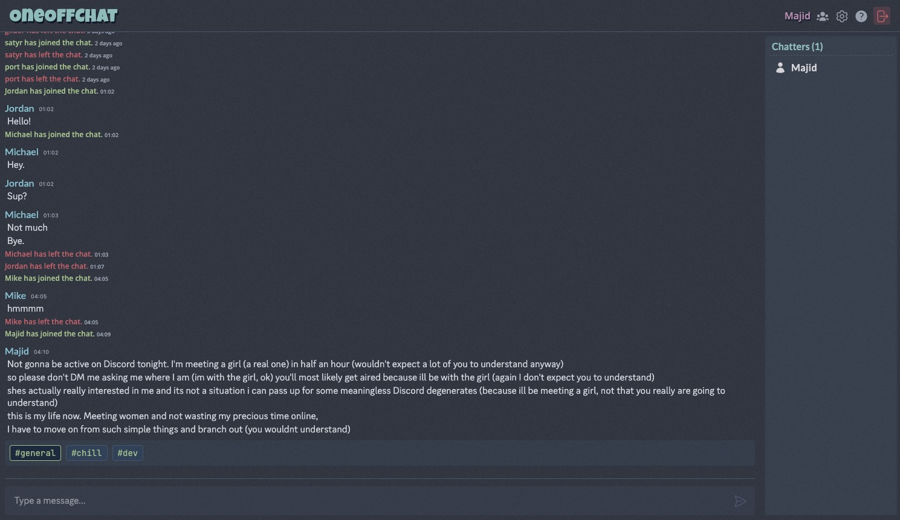

# A Fully-functional Chat Application with Phoenix Framework
Unlike many other examples on the web, this project goes beyond the basics to provide a fully-functional chat application built with the Phoenix Framework, leveraging LiveView. It demonstrates real-time communication, user authentication, and a beautiful, responsive UI.



## Features
* Real-time chat (duh!)
* Multiple chat rooms
* Online chatters presence tracking
* User mentions and notifications
* Direct messages with option to disable them for everyone or a specific user
* Chatter typing indicator
* Command parsing
* Rate-limiting to prevent spam
* Command-based user registration
* Moderation tools (ban, kick)
* Database persistence for chat history (SQLite)
* Localized timestamps for messages

## Working Example
You can see a working example of this chat app at [OneOffChat](https://oneoffchat.com). No registered account is required to use it, but you can register an account with the `/register` command.

## Setting up an admin account
Because this app focuses on simplicity, it avoids bloated admin dashboards. Granting admin privileges is done directly through the database via the IEx console.

In order to set up an admin account:
* First, join the chat normally and register your username using the `/register <password>` command in the chat screen
* Then, open your terminal and start the interactive Elixir console locally with the `iex -S mix` command:
```elixir
alias Oneoffchat.Repo
alias Oneoffchat.Accounts.Chatter

# Fetch your user record
user = Repo.get_by(Chatter, username: "your_username")

# Update the is_admin flag
Ecto.Changeset.change(user, is_admin: true) |> Repo.update!()
```

## Local Development
### Docker and Dev Containers (Recommended)
* Clone the repository and open it in VS Code
* Open the command palette (Ctrl+Shift+P) and select "Dev Containers: Open Folder in Container"
* Wait for the container to build and start
* Open VS Code's integrated terminal (which will be directly running inside the container)
* Run `mix setup` to install and setup dependencies
* Start Phoenix endpoint with `mix phx.server` or inside IEx with `iex -S mix phx.server`

(If you don't want to use the integrated terminal, you can also run `devcontainer exec mix setup` and `devcontainer exec mix phx.server` in a separate terminal to start the server.)

### Without Dev Containers
* Run `docker compose up -d` 
* Run `docker compose exec web mix setup` to install and setup dependencies
* Run `docker compose exec web mix phx.server` to start the Phoenix endpoint

You can now visit [`localhost:4000`](http://localhost:4000) from your browser.

## License
This project is licensed under the MIT License. See the [LICENSE](LICENSE) file for details.